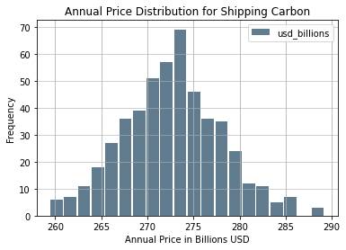

# A Monte Carlo Projection of the Annual Cost of Shipping Carbon from Europe to US Ports


## Introduction

I produced an earlier [report](https://blog.jnapolitano.io/wells-near-ports/) that identified potential ports that may be suitable terminals for carbon imports into the United States for storage or industrial applications.  

Following this report I became interested in what the annual cost to ship super critical co2 could be.  In this report, I analyze the results of a Monte Carlo simulation that projects the annual cost of shipping carbon across the atlantic from Europe to the United States.

## Methodology


### Variables
To account for dynamic variables I designed a Monte Carlo simulation that randomly selected variables across normal distributions bounded by minima and maxima.

The current simulation includes:
* Variable shipping distances
* Variable shipping capacity
* Variable ports of origin
* Variable terminal ports
* Variable round trip shipping duration

Fixed variables include:
* Cost of Transport per ton (though this will be converted to a random distribution as soon as I find a better data source)


### Infrastructure


#### Source 
Susanna Dorigoni, Luigi Mazzei, Federico Pontoni, and Antonio Sileo
IEFE – Centre for Research on Energy and Environmental Economics and Policy,
Università Bocconi, Milan, Italy


#### Capacity of Ships

To complete this analysis, I converted values found for lng shipping to super critical co2.  To do this,  I converted LNG capacties to super critical Co2 with the following conversion factors:
* 1 tonne co2 super critical = 2.64812 meter cubed super critical co2
* 1 tonnes LNG = 2.21 m3 LNG (liquid) 
* 1 tonne co2 = 544.66 m^3


The capacity range: 
* The lower bound of the distribution is 33358 cubic meteres
* The upper bound is 175132
* The median provided is 114723
* The standard deviation is 5


#### Number of Tankers


The number of tankers in the atlantic basin dedicated to LNG transort recorded in 2008 was 63.  I calculated a rough estimate of 25 percent of these being used to transport carbon annually.  A better source is needed to accurately model.  If ships are used to transport both lng and carbon a random distribution designed according to a probability distribution would suitably model the data.  

A total of 15 tankers were modelled.  


## Findings

Shipping carbon from Europe at an uncontrained rate is very clearly a billion doallar industry.  

Across 500   years of modelling we see about 273 billion dollars worth of economic activity per annum.  


```python
samples_df.describe()
```


<div style="overflow-x:auto;">
<style scoped>
    .dataframe tbody tr th:only-of-type {
        vertical-align: middle;
    }

    .dataframe tbody tr th {
        vertical-align: top;
    }

    .dataframe thead th {
        text-align: right;
    }
</style>
<table border="1" class="dataframe">
  <thead>
    <tr style="text-align: right;">
      <th></th>
      <th>usd_billions</th>
    </tr>
  </thead>
  <tbody>
    <tr>
      <th>count</th>
      <td>500.000000</td>
    </tr>
    <tr>
      <th>mean</th>
      <td>272.716415</td>
    </tr>
    <tr>
      <th>std</th>
      <td>5.352208</td>
    </tr>
    <tr>
      <th>min</th>
      <td>259.417903</td>
    </tr>
    <tr>
      <th>25%</th>
      <td>269.038222</td>
    </tr>
    <tr>
      <th>50%</th>
      <td>272.779910</td>
    </tr>
    <tr>
      <th>75%</th>
      <td>276.060047</td>
    </tr>
    <tr>
      <th>max</th>
      <td>289.222052</td>
    </tr>
  </tbody>
</table>
</div>


## Calculating the Confidence Interval

The data is nearly normal.  I could test for normality, but that would be beyond the scope of this analysis.  Also, by design the Monte Carlo model should produce a normal distribution with sufficient samples.  


```python

st.norm.interval(alpha=0.90, loc=np.mean(samples_df['usd_billions']), scale=st.sem(samples_df['usd_billions']))
```


    (272.32270640728865, 273.11012424532606)


It is safe to assume that 90 percent of the time we would see an annual cost of 272.32 to 273.11 billion dollars usd with the assumptions of the model taken into account.  

### Monte Carlo Historgram

The data is nearly normal.  It would be fair to expect a range of about 272.32 to 273.11 billion dollars.


```python
samples_df.plot.hist(grid=True, bins=20, rwidth=0.9,
                   color='#607c8e')
plt.title('Annual Price Distribution for Shipping Carbon')
plt.xlabel('Annual Price in Billions USD')
plt.ylabel('Frequency')
plt.grid(axis='y', alpha=0.75)
```


    

    


## The Take Away

Carbon Capture is likely a trillion dollar economy at scale.  In just reviewing shipping super critical co2 from Europe to the United States, a 272 billion dollar per annum industry could develop as nations move towards a net carbon zero economy.  


## Limitations of the Model 

The model as it is presented in this report is unconstrained.  A more accurate portrayal of what would be possible with current systems in place could be designed with better data.  It is also important to note that I have not included incentives into the model.  It is entirely possible that government subsidies could prove the carbon shipping industry to be more expansive than presented here.

## Data Imports and Manipulation

### The Shipping Dataframe

The shipping dataframe is the basis of the simulation.  It is used to tabulate total cost and to record the values of variables.

#### Capacity Distribtuion and Number of Ships Calculation


```python
# Capacity range
# 40,000 m3 71,500 to 210,000

#Susanna Dorigoni, Luigi Mazzei, Federico Pontoni, and Antonio Sileo
#IEFE – Centre for Research on Energy and Environmental Economics and Policy,
#Università Bocconi, Milan, Italy

# I'm sure a better report is available but this is a start
# cubic meters unit

### a rough estimate of global suplly dedicated to co2 shipping

# I will probably need a better metric but this is a good start that can be modified later when necessary

ships = int(63*.25)
ships


conversion_factor = 2.21/2.65
conversion_factor

lower_bound = int(40000 * conversion_factor)
upper_bound = int(210000 * conversion_factor)

median = 137564 * conversion_factor
standard_dev = 6.63 * conversion_factor  #file:///Users/jnapolitano/Downloads/LNG_Shipping_a_Descriptive_Analysis.pdf

cap_range = range(lower_bound, upper_bound)

cap_distribution = np.random.normal(loc=median , scale=standard_dev, size=ships)


```

#### The Shipping Df


```python
shipping_df = pd.DataFrame(cap_distribution, columns=['co2_capacity_cubic_meters'])
shipping_df['days_to_port'] = 0
shipping_df['europe_port'] = ''
shipping_df["us_port"] =''
shipping_df['distance'] =''
shipping_df['price'] = 0
shipping_df['co2_capacity_tonnes'] = shipping_df['co2_capacity_cubic_meters']/544.66 ## Verify this factor.  It seems to high
shipping_df
```


<div style="overflow-x:auto;">
<style scoped>
    .dataframe tbody tr th:only-of-type {
        vertical-align: middle;
    }

    .dataframe tbody tr th {
        vertical-align: top;
    }

    .dataframe thead th {
        text-align: right;
    }
</style>
<table border="1" class="dataframe">
  <thead>
    <tr style="text-align: right;">
      <th></th>
      <th>co2_capacity_cubic_meters</th>
      <th>days_to_port</th>
      <th>europe_port</th>
      <th>us_port</th>
      <th>distance</th>
      <th>price</th>
      <th>co2_capacity_tonnes</th>
    </tr>
  </thead>
  <tbody>
    <tr>
      <th>0</th>
      <td>114722.058446</td>
      <td>0</td>
      <td></td>
      <td></td>
      <td></td>
      <td>0</td>
      <td>210.630592</td>
    </tr>
    <tr>
      <th>1</th>
      <td>114722.867438</td>
      <td>0</td>
      <td></td>
      <td></td>
      <td></td>
      <td>0</td>
      <td>210.632078</td>
    </tr>
    <tr>
      <th>2</th>
      <td>114718.413428</td>
      <td>0</td>
      <td></td>
      <td></td>
      <td></td>
      <td>0</td>
      <td>210.623900</td>
    </tr>
    <tr>
      <th>3</th>
      <td>114726.644196</td>
      <td>0</td>
      <td></td>
      <td></td>
      <td></td>
      <td>0</td>
      <td>210.639012</td>
    </tr>
    <tr>
      <th>4</th>
      <td>114717.890366</td>
      <td>0</td>
      <td></td>
      <td></td>
      <td></td>
      <td>0</td>
      <td>210.622940</td>
    </tr>
    <tr>
      <th>5</th>
      <td>114724.390072</td>
      <td>0</td>
      <td></td>
      <td></td>
      <td></td>
      <td>0</td>
      <td>210.634873</td>
    </tr>
    <tr>
      <th>6</th>
      <td>114728.150802</td>
      <td>0</td>
      <td></td>
      <td></td>
      <td></td>
      <td>0</td>
      <td>210.641778</td>
    </tr>
    <tr>
      <th>7</th>
      <td>114722.486489</td>
      <td>0</td>
      <td></td>
      <td></td>
      <td></td>
      <td>0</td>
      <td>210.631378</td>
    </tr>
    <tr>
      <th>8</th>
      <td>114732.540018</td>
      <td>0</td>
      <td></td>
      <td></td>
      <td></td>
      <td>0</td>
      <td>210.649837</td>
    </tr>
    <tr>
      <th>9</th>
      <td>114716.979721</td>
      <td>0</td>
      <td></td>
      <td></td>
      <td></td>
      <td>0</td>
      <td>210.621268</td>
    </tr>
    <tr>
      <th>10</th>
      <td>114720.899956</td>
      <td>0</td>
      <td></td>
      <td></td>
      <td></td>
      <td>0</td>
      <td>210.628465</td>
    </tr>
    <tr>
      <th>11</th>
      <td>114730.255969</td>
      <td>0</td>
      <td></td>
      <td></td>
      <td></td>
      <td>0</td>
      <td>210.645643</td>
    </tr>
    <tr>
      <th>12</th>
      <td>114717.927588</td>
      <td>0</td>
      <td></td>
      <td></td>
      <td></td>
      <td>0</td>
      <td>210.623008</td>
    </tr>
    <tr>
      <th>13</th>
      <td>114717.983103</td>
      <td>0</td>
      <td></td>
      <td></td>
      <td></td>
      <td>0</td>
      <td>210.623110</td>
    </tr>
    <tr>
      <th>14</th>
      <td>114723.044902</td>
      <td>0</td>
      <td></td>
      <td></td>
      <td></td>
      <td>0</td>
      <td>210.632404</td>
    </tr>
  </tbody>
</table>
</div>


### The European Ports Df


```python

gisfilepath = "/Users/jnapolitano/Projects/data/energy/PORT_2013_SH/Data/PORT_PT_2013.shp"


ports_df = gpd.read_file(gisfilepath)

ports_df = ports_df.to_crs(epsg=3857)
```

### Filtered Wells DataFrame


```python
## Importing our DataFrames

gisfilepath = "/Users/jnapolitano/Projects/data/energy/filtered-wells.geojson"


filtered_df = gpd.read_file(gisfilepath)

filtered_df = filtered_df.to_crs(epsg=3857)


```

#### Getting Map Conditions for Us Port Filtering


```python
map_conditions = filtered_df.TERMID.unique().tolist()
```

### US Ports Dataframes


```python
## Importing our DataFrames

gisfilepath = "/Users/jnapolitano/Projects/data/energy/Liquified_Natural_Gas_Import_Exports_and_Terminals.geojson"


terminal_df = gpd.read_file(gisfilepath)

terminal_df = terminal_df.to_crs(epsg=3857)


```


```python
terminal_df.drop(terminal_df[terminal_df['STATUS'] == 'SUSPENDED'].index, inplace = True)
terminal_df.rename(columns={"NAME": "TERMINAL_NAME"})
terminal_df['TERMINAL_GEO'] = terminal_df['geometry'].copy()

```


```python
port_terminals_df = terminal_df.query('TERMID in @map_conditions').copy()
port_terminals_df['co2_capacity_mmta'] = port_terminals_df['CURRENTCAP'] * conversion_factor
port_terminals_df['co2_capacity_metric_tons'] = port_terminals_df['co2_capacity_mmta'] * 1000000
port_terminals_df['available'] = True
```

## Random Distribution, Distance and Pricing Functions 

### Accounting for Random Days at Sea

As days at sea is variable I created a range between 20 and 40 days to account for a round trip to every major port in europe.  


```python

def random_day():
    lower_bound = 20
    upper_bound = 40

    median = 30
    standard_dev = 2

    days_range = range(lower_bound, upper_bound)

    days_distribution = np.random.normal(loc=median , scale=standard_dev, size=ships)


    days_randomized = np.random.choice(days_distribution, size=1)


    return (days_randomized[0].astype(np.int64))

```

### Accounting for Random European Ports

I randomized the Port Selection Process with the following function.  The Data provided by eurostat did not filter according to type of port.  Nonetheless, the distance recorded should be very similiar to those of actual lng ports.  A better data set could be substituded directly into the function


```python

def random_europe_port():
    #select a random number along the index of the ports df.  Return the value of hte geometry at the index.  
    #select indices from the dataframe that are valid.  ie capacity has not yet been met.  
    ports_randomized = np.random.choice(ports_df.index, size=1)
    index_location = ports_randomized[0]
    return ports_df.geometry[index_location]

```

### Accounting for Random US Ports

I was able to filter import/export ports in the United States in to a dataset of about 15.  Like the European dataset I randomized selection


```python

def random_us_port():
    #select a random number along the index of the ports df.  Return the value of hte geometry at the index.  

    ports_randomized = np.random.choice(port_terminals_df.index, size=1)
    index_location = ports_randomized[0]
    return port_terminals_df.geometry[index_location]

```

### Calculating Distance Between Ports

I calculated the shortest distance between ports based on their geographic locations with the shapley.distance function.  It returns distance in meters.  I divide by 1000 to convert into km.   The algorithm could be improved by using official shipping data to randomize a distribution of distances between ports.  Unfortunately, I do not have that data available to me.  


```python

def geo_distance(dist1,dist2):
    # return distance in km
    distance = dist1.distance(dist2)*1000
    return(distance)

    

```

#### Calculating Price of Transport

The cost of transport accounts for port fees, liquification, and transport.   Unfortunately, my data is from a paper published in 2004.  I would like to find a more recent paper.   I did not convert the value of 2004 usd to 2022 because I am not sure of the validity of the conversion factors available online.  I would need a better source to correctly model the true cost of transport.  

[source](https://ieaghg.org/docs/General_Docs/Reports/PH4-30%20Ship%20Transport.pdf)


```python

def price_to_transport(distance):
    price = (distance/100) * 12
    return price

```

## Costs Per Annum Algorithm

The algorithm I used calculates the daily status of ships transporting co2 across the atlantic from a European port to a port in the United States.  It will run for 365 iterations or until the total carbon capacity of the us ports is reached.  This value could also be dynamically allocated via a similiar algorithm, but the algorithm performance would suffer at the cost of marginal model improvements.  

When the daily counter reaches zero for a ship
     * The capacity is refilled to full
     * A random us port is assigned
     * a random european port is assigned
     * the distance between ports is calculated
     * the cost of transport over that distance is calculated per 100 km 
     * The total shipping price of that cycle is tabulated
     * The total tonnage of that cycle is tabulated


```python

days = 365
day_counter = 0 
carbon_total_millions_metric_tons = 300000000
total_tons_shipped = 0
total_price = 0

#deduction = capacity of empty ships
for day in range(days):
    if carbon_total_millions_metric_tons >= 0:
        # must use apply to account for multiple 0 conditions.  If i simply vectorized the function i could assing the the same values each day 
        shipping_df['days_to_port'] = shipping_df['days_to_port'] - 1
        shipping_df['us_port'] = shipping_df.apply(lambda x:  random_us_port() if x['days_to_port']<=0 else x['us_port'], axis=1)
        shipping_df['europe_port'] = shipping_df.apply(lambda x:  random_europe_port() if x['days_to_port']<=0 else x['europe_port'], axis=1)
        shipping_df['distance'] = shipping_df.apply(lambda x:  geo_distance(x['us_port'], x['europe_port']) if x['days_to_port']<=0 else x['distance'], axis=1)
        shipping_df['price'] = shipping_df.apply(lambda x:  price_to_transport(x['distance']) if x['days_to_port']<=0 else x['price'], axis=1)
        # query all that are = o.  Summate the capacities deduct the total 
        tmp_df=shipping_df.loc[shipping_df['days_to_port'] <= 0]
        sum_of_capacity = tmp_df['co2_capacity_tonnes'].sum()
        sum_of_price = tmp_df['price'].sum()
        shipping_df['days_to_port'] = shipping_df['days_to_port'].apply(lambda x: random_day() if x<=0 else x)
        total_tons_shipped = total_tons_shipped + sum_of_capacity
        total_price = total_price + sum_of_price
        carbon_total_millions_metric_tons = carbon_total_millions_metric_tons - sum_of_capacity
        #print(carbon_total_millions_metric_tons)
        day_counter = day_counter+1
    else: 
        break

    
    
print(day_counter)
print(total_tons_shipped)
print(total_price)
```

    365
    39177.55734226863
    273610171402.87534


## Monte Carlo Simulation with 500 iterations

The annual rate of shipping can be variable according to shifting dynamics. I account for that by modelling the per annum algorithm 500 times.  Modelling would improve as n increases, but for the sake of time I limited the commputation to 500 iterations

The only difference between this algorithm and the previous one is an extra for loop.  The algorithmic efficiency is surprisingly good as the I was able to vectorize tabulations with lambda functions across the dataframes.  On my laptop, I was able to complete the algorithm in about 16 minutes of run time.


```python

nsamples = 500
price_samples = np.zeros(shape=500)

for sample in range(nsamples):

    days = 365
    day_counter = 0 
    carbon_total_millions_metric_tons = 300000000
    total_tons_shipped = 0
    total_price = 0

    #deduction = capacity of empty ships
    for day in range(days):
        if carbon_total_millions_metric_tons >= 0:
            # must use apply to account for multiple 0 conditions.  If i simply vectorized the function i could assing the the same values each day 
            shipping_df['days_to_port'] = shipping_df['days_to_port'] - 1
            shipping_df['us_port'] = shipping_df.apply(lambda x:  random_us_port() if x['days_to_port']<=0 else x['us_port'], axis=1)
            shipping_df['europe_port'] = shipping_df.apply(lambda x:  random_europe_port() if x['days_to_port']<=0 else x['europe_port'], axis=1)
            shipping_df['distance'] = shipping_df.apply(lambda x:  geo_distance(x['us_port'], x['europe_port']) if x['days_to_port']<=0 else x['distance'], axis=1)
            shipping_df['price'] = shipping_df.apply(lambda x:  price_to_transport(x['distance']) if x['days_to_port']<=0 else x['price'], axis=1)
            # query all that are = o.  Summate the capacities deduct the total 
            tmp_df=shipping_df.loc[shipping_df['days_to_port'] == 0]
            sum_of_capacity = tmp_df['co2_capacity_tonnes'].sum()
            sum_of_price = tmp_df['price'].sum()
            shipping_df['days_to_port'] = shipping_df['days_to_port'].apply(lambda x: random_day() if x<=0 else x)
            total_tons_shipped = total_tons_shipped + sum_of_capacity
            total_price = total_price + sum_of_price
            carbon_total_millions_metric_tons = carbon_total_millions_metric_tons - sum_of_capacity
            #print(carbon_total_millions_metric_tons)
            day_counter = day_counter+1
        else: 
            break

        
        
    

    price_samples[sample] = total_price

        

```

### Creating the Samples DF


```python
samples_df = pd.DataFrame(price_samples, columns=['cost_in_usd'])
```


```python
samples_df['usd_billions'] = samples_df.cost_in_usd / 1000000000
samples_df.drop(columns=['cost_in_usd'], inplace=True)
```

## Imports


```python
import pandas as pd
import matplotlib.pyplot as plt
import geopandas as gpd
import folium
import contextily as cx
import rtree
from zlib import crc32
import hashlib
from shapely.geometry import Point, LineString, Polygon
import numpy as np
from scipy.spatial import cKDTree
import scipy.stats as st
from shapely.geometry import Point
from haversine import Unit
from geopy.distance import distance

import warnings

warnings.filterwarnings('ignore')

```